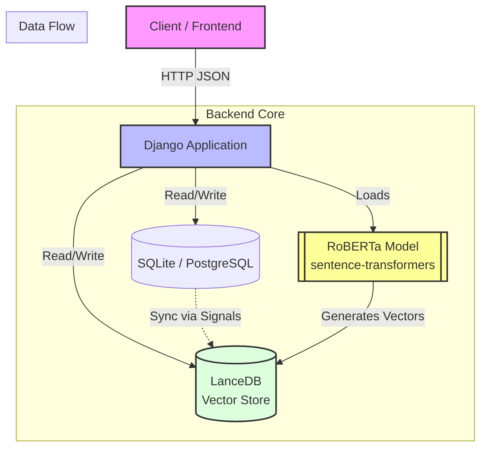
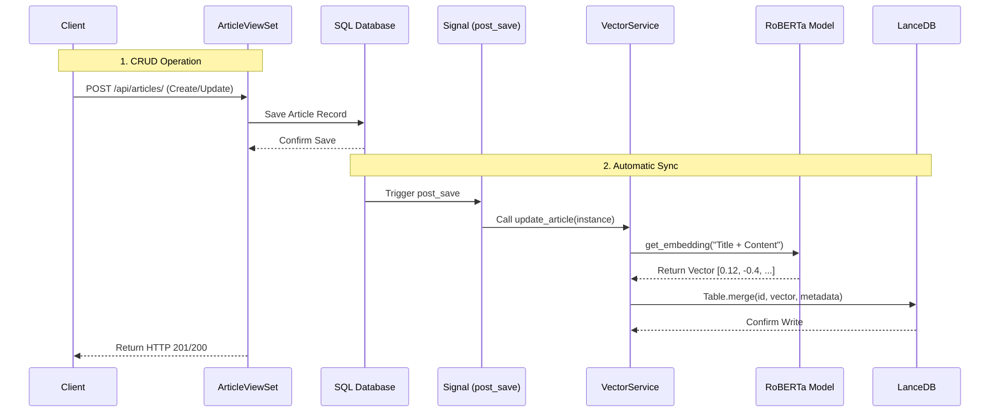
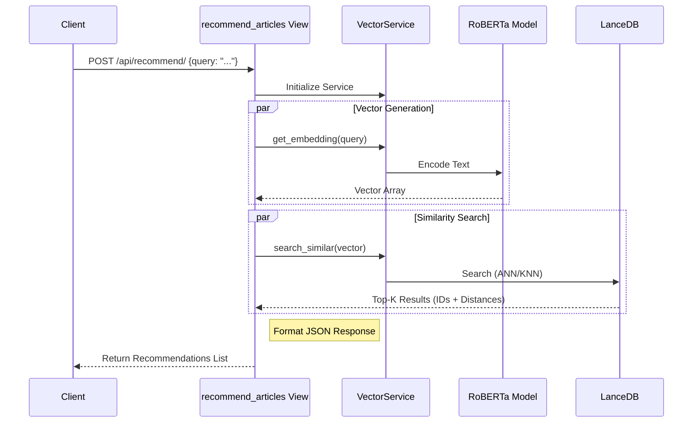
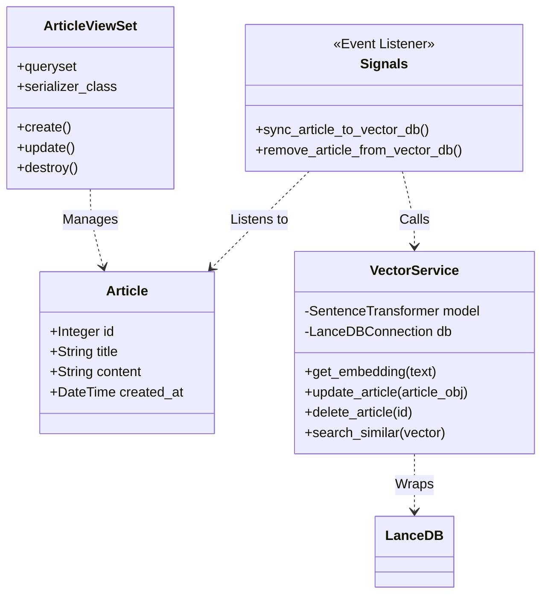

# Django Semantic Recommendation Engine

A high-performance, content-aware recommendation system built with **Django**, **LanceDB**, and **RoBERTa**.

This project implements a hybrid architecture where structured data is managed by **PostgreSQL/SQLite** (via Django) and semantic vector embeddings are managed by **LanceDB**. It features automatic data synchronization and real-time semantic search.

---

## 🏗 Architecture

The system uses **Django Signals** to keep the Vector Database in sync with the SQL Database automatically.

Here are four essential diagrams using **MermaidJS** to document your system. These cover the high-level architecture, the write path (CRUD + Signals), the read path (Recommendations), and the class structure.

### 1. High-Level System Architecture
This diagram gives a future engineer a 10,000-foot view of how the components interact. It highlights the separation between the **SQL Database** (Source of Truth) and **LanceDB** (Search Index).



---

### 2. The "Write" Path: Data Synchronization Logic
This sequence diagram explains the most "magic" part of the system: **How data gets into LanceDB automatically.** It details the flow from the API call to the Signal trigger.



---

### 3. The "Read" Path: Recommendation Logic
This documents how a user query is transformed into a semantic result.



---

### 4. Class & Component Structure
This is useful for a developer opening the codebase for the first time to understand where the logic lives and how the files relate.



## ✨ Features

*   **Semantic Search:** Finds items based on meaning, not just keyword matching (e.g., searching "pasta" finds "Carbonara").
*   **Real-time Indexing:** Creating or updating an article via the API immediately updates the Vector Index.
*   **Serverless Vector DB:** Uses LanceDB (embedded), requiring no external docker containers or cloud services for vector storage.
*   **SOTA NLP:** Uses `all-distilroberta-v1` for high-quality sentence embeddings.
*   **Full CRUD API:** Built with Django REST Framework.

---

## 🚀 Installation & Setup

### 1. Prerequisites
*   Python 3.9+
*   pip

### 2. Clone and Install
```bash
git clone https://github.com/yourusername/recommendation-engine.git
cd recommendation-engine

# Create virtual environment
python -m venv venv
source venv/bin/activate  # On Windows: venv\Scripts\activate

# Install dependencies
pip install django djangorestframework lancedb sentence-transformers pandas numpy
```

### 3. Database Setup
```bash
# Run Django migrations
python manage.py migrate
```

### 4. Load Sample Data (Optional)
We include scripts to populate the DB with sample articles and index them.
```bash
# 1. Create sample articles in SQL
python manage.py populate_db

# 2. Vectorize existing articles and store in LanceDB
python manage.py index_articles
```

### 5. Run Server
```bash
python manage.py runserver
```

---

## 📡 API Documentation

### 1. Recommendations / Semantic Search
**Endpoint:** `POST /api/recommend/`

**Scenario A: Search by Text**
Finds articles similar to a user query.
```bash
curl -X POST http://127.0.0.1:8000/api/recommend/ \
     -H "Content-Type: application/json" \
     -d '{"query": "How to build neural networks"}'
```

**Scenario B: Item-to-Item Recommendation**
Finds articles similar to a specific Article ID.
```bash
curl -X POST http://127.0.0.1:8000/api/recommend/ \
     -H "Content-Type: application/json" \
     -d '{"article_id": 1}'
```

### 2. Articles CRUD
Standard management of the content. **Note:** All changes here are automatically reflected in LanceDB.

**List All:**
`GET /api/articles/`

**Create Article:**
```bash
curl -X POST http://127.0.0.1:8000/api/articles/ \
     -H "Content-Type: application/json" \
     -d '{
           "title": "New Tech Trend",
           "content": "Quantum computing is changing encryption standards."
         }'
```

**Update Article:**
`PATCH /api/articles/{id}/`

**Delete Article:**
`DELETE /api/articles/{id}/`

---

## 📂 Project Structure

```text
my_project/
├── manage.py
└── recommendations/
    ├── models.py          # SQL Data Schema
    ├── vector_db.py       # LanceDB & RoBERTa Logic (Singleton)
    ├── signals.py         # Automates SQL -> LanceDB Sync
    ├── views.py           # API Endpoints
    ├── serializers.py     # JSON Serialization
    └── management/
        └── commands/      # Helper scripts (populate_db, index_articles)
```

---

## 🧠 Technical Details

### The Vector Service (`vector_db.py`)
This class implements the Singleton pattern. It loads the RoBERTa model into memory only once when the server starts. It handles:
1.  Generating embeddings (768 dimensions).
2.  Managing the LanceDB connection (stored locally in `data/lancedb_store`).
3.  Upserting and Searching vectors.

### Data Synchronization (`signals.py`)
To ensure the vector index never goes stale, we use Django's `post_save` and `post_delete` signals.
*   **Write Path:** App -> SQL Save -> Signal Trigger -> Generate Vector -> LanceDB Upsert.
*   **Delete Path:** App -> SQL Delete -> Signal Trigger -> LanceDB Delete.

### Known Logs
On server startup, you may see:
`embeddings.position_ids | UNEXPECTED`
This is a harmless warning from the `transformers` library regarding the specific pre-trained weights of DistilRoBERTa. It can be safely ignored.

---

## 🛠 Management Commands

*   `python manage.py populate_db`: Wipes the database and creates 12 sample articles across Tech, Nature, Food, and Finance.
*   `python manage.py index_articles`: Iterates through all SQL articles, generates missing vectors, and stores them in LanceDB. Useful if you import data via raw SQL or if the LanceDB files get corrupted.
```